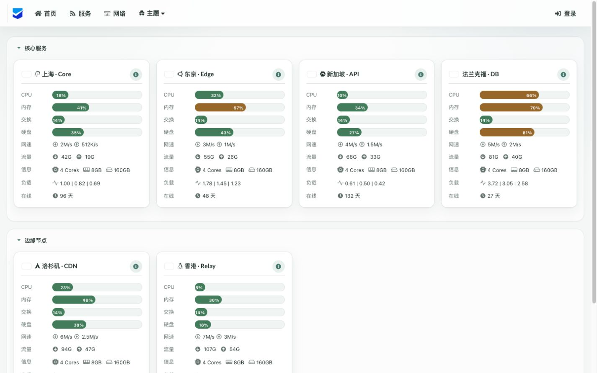

<div align="center">
  <br><br>
  
  <h1>Nezha Zero <sub>Refined</sub></h1>
  <p><b>轻量、自托管的服务器与网站监控</b></p>
  <p>为前台与管理后台重新整理的一层安静、克制的界面。</p>
  <p>
    <a href="#一键安装--install">一键安装</a>&nbsp;&nbsp;·&nbsp;&nbsp;
    <a href="docs/debian-nginx-cloudflare.md">部署教程</a>&nbsp;&nbsp;·&nbsp;&nbsp;
    <a href="https://github.com/railzen/nezha-zero">上游项目</a>
  </p>
  <p>
    <a href="https://github.com/aoomee/nezha-zero-refined/actions/workflows/refined-ci.yml"></a>
    <a href="https://github.com/aoomee/nezha-zero-refined/pkgs/container/nezha-zero-refined"></a>
    <a href="https://github.com/aoomee/nezha-zero-refined/blob/main/LICENSE"></a>
  </p>
  <br>
  
  <br><br>
</div>

> 基于 [railzen/nezha-zero](https://github.com/railzen/nezha-zero)。保留上游功能与数据兼容性，仅为前台、登录与管理后台增加独立的简约视觉设计。

## 概要 / Abstract

本项目基于哪吒 V0 版本进行二次开发，并持续合并上游 `main`。除保留原项目的特性外，Refined 额外提供：

- 前台、登录页、管理后台统一的简约界面；卡片、表单、弹窗、导航与终端入口保持一致。
- 首页加载动画、紧凑的信息排版、移动端适配，以及更平静的交互反馈。
- 后台可设置站点 Logo 与连接页 Logo；留空时保持默认图标。
- 多架构镜像：`amd64`、`arm64`、`s390x`。
- Docker 一键安装、健康检查、失败回滚和每日上游同步。

原项目的主要能力继续保留：

- 最新 GEOIP 库和管理界面安装 Agent 的链接。
- 修复部分失效 CDN 引用，管理后台静态文件本地化。
- 支持密码登录、二次认证 2FA、IPv4 复制按钮、手动国家码/国旗、公开备注可视化编辑与设备自动发现。
- 支持使用外部 GEOIP 库查询国家信息，以及有限的移动端优化。

#### 稳定性与兼容性

- Dashboard 升级尽量保证历史版本 Agent 可用，不强制升级 Agent。
- 兼容上游数据目录和数据库，已有部署可迁移。
- 上游自动同步须通过边界检查、Dashboard/Agent 测试和镜像冒烟测试后才发布。

## 一键安装 / Install

Debian / Ubuntu 服务器可直接执行：

```shell
curl -fsSL https://raw.githubusercontent.com/aoomee/nezha-zero-refined/main/install.sh | sudo sh
```

脚本会在需要时安装 Git、Docker Engine 与 Docker Compose v2，将项目安装到 `/opt/nezha-zero-refined`，自动生成管理员密码和 Agent 发现密钥，并启动面板。

- 默认网页端口：`10086`
- 默认 Agent RPC 端口：`10086`（HTTP 与 gRPC 共用一个端口）
- 默认管理员：`admin`
- 首次安装的密码会显示在终端，同时保存在 `/opt/nezha-zero-refined/.env`

需要 Nginx + Cloudflare 单端口 gRPC 时，请查看 [Debian + Nginx + Cloudflare 教程](docs/debian-nginx-cloudflare.md)。

镜像地址：

```shell
ghcr.io/aoomee/nezha-zero-refined:latest
```

## 一键迁移 / Migrate

本项目保留上游数据目录格式。迁移前请停止旧容器并备份原数据，再执行：

```shell
git clone https://github.com/aoomee/nezha-zero-refined.git
cd nezha-zero-refined
cp -a /path/to/old-nezha/data ./data
./refined-install.sh
```

不要同时让新旧 Dashboard 写入同一个 SQLite 数据库。迁移后，登录后台检查站点、Agent 域名和 TLS 设置即可。

## 兼容 API / Compatible API

合并了哪吒 V1 版本的部分读取功能 API。目前支持：

- 前台界面的所有 API（包括 WebSocket）。
- 后台界面的部分只读 API。
- 服务器、告警、通知的信息获取。
- [Nezha-Mobile](https://github.com/hiDandelion/Nezha-Mobile) 的大部分只读功能。
- 开启和关闭 V1 版本 API。

关于鉴权：

- 密码登录默认开启，管理员用户名与 OAuth 管理员列表共用；密码可在设置界面修改。
- 支持 V1 `/api/v1/login` 接口登录。
- 支持 Cookie `nz-jwt`、`Authorization: Bearer <API Key>`、`Authorization: <API Key>` 三种 API Key 认证方式。

## 界面预览 / Screenshots

前台、登录页、设置、日志、终端与文件管理入口均使用同一套圆角、间距、颜色与按钮规则。站点和连接页 Logo 可在设置页直接替换。

<details>
<summary>查看上游 Dashboard 与主题预览</summary>

<br>

| Dashboard | Login Panel |
| --- | --- |
|  |  |

| ServerStatus | DayNight | hotaru |
| --- | --- | --- |
|  |  |  |

| Neko Mdui | AngelKanade | Default Theme |
| --- | --- | --- |
|  |  |  |

面板安装后可在设置页（`/setting`）切换语言与主题。

</details>

## 备注和公开备注 / Public Note

支持在公开备注中展示到期时间和手动国家码。完整格式请参考 [账单信息备注](https://github.com/nezhahq/nezha/pull/425#issuecomment-2389107872)：

```html
{
  "billingDataMod": {
    "startDate": "2025-10-01",
    "endDate": "2027-01-01"
  },
  "countryCode": "HK"
}
```

`endDate` 可写 `0000-00-00` 表示长期。管理后台提供公开备注可视化编辑，可直接写入对应数据。

## 更新与上游同步 / Update

手动更新：

```shell
cd /opt/nezha-zero-refined
./refined-update.sh
```

更新前脚本会创建数据备份；新容器未通过健康检查时会自动恢复旧镜像与旧数据。项目每天同步上游 `main`，仅在测试、构建和镜像冒烟测试全部通过后才发布新版镜像，因此美化层不会被上游同步直接覆盖。

## 关于安全 / Security

面板安全问题始终优先处理。上游同步中的安全修复会进入本项目，并须通过 Dashboard 与 Agent 测试后发布。若发现安全问题，欢迎及时提交 Issue。

## 致谢 / Acknowledgements

- [railzen/nezha-zero](https://github.com/railzen/nezha-zero): Nezha Zero 上游项目
- [nezhahq/nezha](https://github.com/nezhahq/nezha): 原版哪吒面板
- [chenx-dust/nezha-compat](https://github.com/chenx-dust/nezha-compat): V1 API 兼容实现
- [hamster1963/nezha-dash](https://github.com/hamster1963/nezha-dash): 前台主题实现
- [hi2shark/nazhua](https://github.com/hi2shark/nazhua): 前台主题实现

本项目遵循 [Apache License 2.0](LICENSE)，使用与分发时请保留原始许可证和上游署名。
